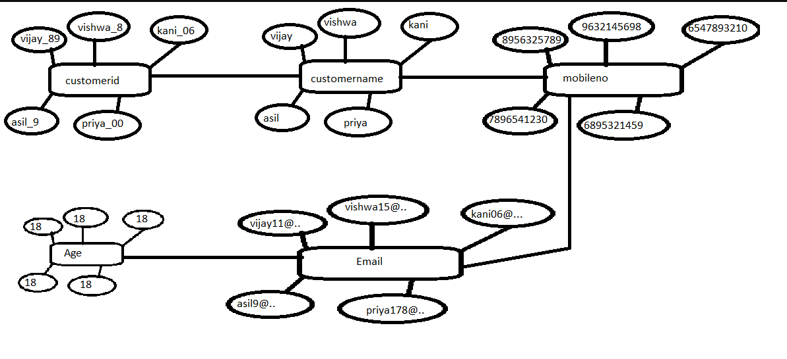
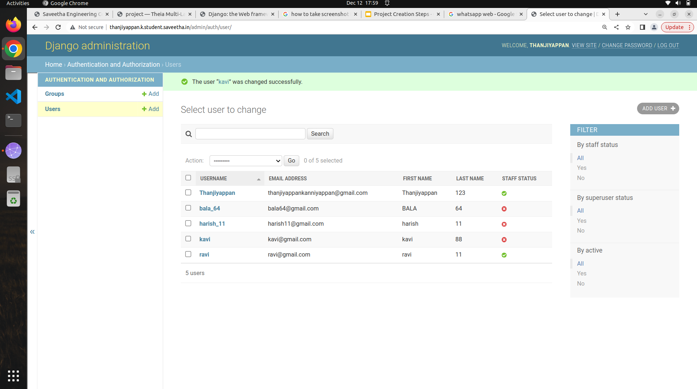

# Django ORM Web Application

## AIM
To develop a Django application to store and retrieve data from a database using Object Relational Mapping(ORM).

## Entity Relationship Diagram


## DESIGN STEPS

### STEP 1:
create a table of customer in ORM

### STEP 2:
upload the python code

### STEP 3:
push into github


## PROGRAM

```
from django.db import models
from django.contrib import admin

# Create your models here.
class Customer(models.Model):
    customerid=models.CharField(max_length=8,primary_key=True)
    customername=models.CharField(max_length=100)
    age=models.IntegerField()
    email=models.EmailField()
    address=models.CharField(max_length=100)

class CustomerAdmin(admin.ModelAdmin):
    list_display = ('customerid','customername','age','email','address')
```

## OUTPUT




## RESULT
thus the program run sucessfully
